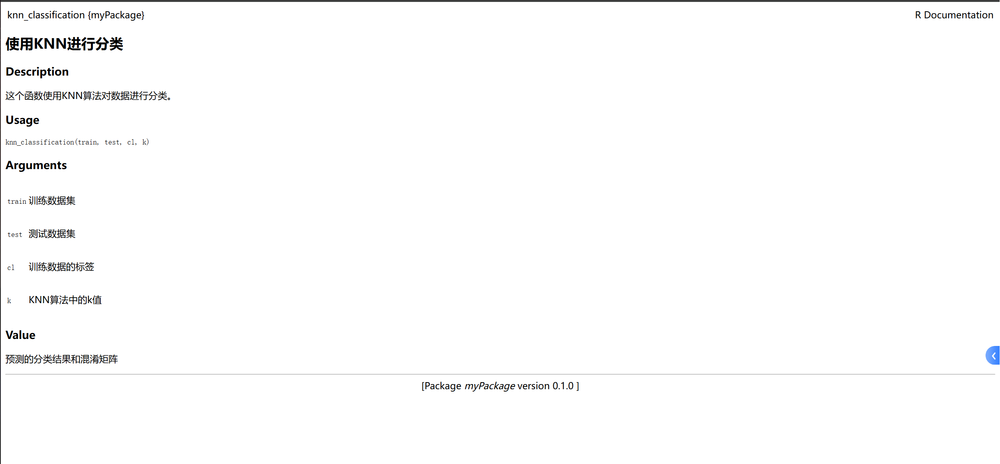

author: 袁莘睿 522071910024

myPackage: 0.1.0

实现分类任务的包，**中含有3个或以上有意义的统计函数**，分别用三种方法 KNN，决策树，SVM 实现分类任务。**调用了 `ggplot2`, `caret`, `e1071`, `rpart`, `class` 等知名软件包**。详情请见 DESCRIPTION.

**函数有完整的使用说明**：

**其他比较重要有价值的要求**：可以自定义训练和预测数据集。

**上传到我的 github 个人主页**: https://starcried.github.io/2024/12/12/R-package-homework/
Password: Rcoding